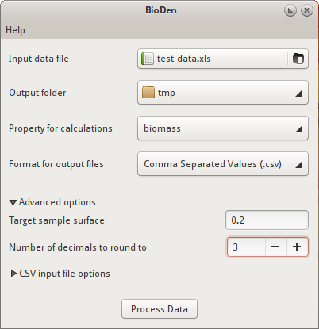

==================================
Welcome to BioDen's documentation!
==================================

BioDen is a data normaliser and processor for files containing taxon
biomass/density data for ecotopes. In general the input file of BioDen includes
a list of records (rows in a table) that give species name, an abundance measure
(biomass and/or density), a sample code, the surface sampled and the ecotope
(see :download:`input example <input_example.html>`). This list is transformed
to a table in which the rows represent species and the columns represent samples
(see :ref:`ouput examples <output_files>`). This table can serve as the input
file for various software applications that conduct species community analyses.

   BioDen screenshot

Users
=====

* `SourceForge Project page <http://sourceforge.net/projects/bioden/>`_
* `Download BioDen <http://sourceforge.net/projects/bioden/files/>`_

Developers
==========

* `Get the source code <https://github.com/figure002/bioden>`_

Contents
========

.. toctree::
   :maxdepth: 2

   installation
   user_manual

Indices and tables
==================

* :ref:`genindex`
* :ref:`modindex`
* :ref:`search`
