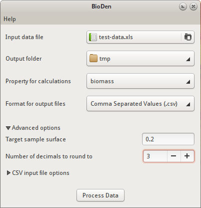

.. _user_manual:

=========================================
User Manual
=========================================

:Release: |release|
:Date: |today|

Starting BioDen
===============

On Windows, go to Start menu > All Programs > GiMaRIS > BioDen > BioDen.

GNU/Linux users can just execute ``bioden``.

Once bioden is started, you'll be presented with its main window.

   BioDen main window

The main window has the following components:

Select input data file
    The CSV or XLS file containing the biomass and/or density data to be processed.
    This file must be in a specific format. This format is described in the
    :ref:`Input File Format <input_file_format>` section.

Select output folder
    Select the folder to which all output files should be saved. The output
    files are described in the :ref:`Output Files <output_files>` section.

Property for calculations
    The property to perform the calculations on. You have a choice between
    "biomass" and "density". Note that the input data file must contain data
    for the specified property. If this is not the case, an error message will
    be displayed.

Format for output files
    The format to save the output files in. You have a choice between "Comma
    Separated Values (.csv)" and "Microsoft Excel 97/2000/XP (.xls)".

    .. note::

      Microsoft Excel files (.xls) support a maximum of 256 columns. Columns
      that exceed this limit will not be exported!

Advanced Options
    Clicking this toggle button shows/hides the advanced options.

Target sample surface:
    The sample surface used for AMBI files. Default is 0.2.

Round values to n decimals:
    Number of decimals to round values in the output files to. Value "-1"
    (default) means do not round.

CSV Input File Options
    Clicking this toggle button shows/hides the options for the CSV input file.

Field delimiter of the input file:
    A one-character string used to separate fields in the input CSV file. It
    defaults to a semicolon (;). By default Excel uses the semicolon for CSV
    files. If the CSV file is exported by a different application, make sure
    this character matches the delimiter in the data file. You can check this
    by opening the data file in a text editor (e.g. Notepad).

Quote character of the input file:
    A one-character string used to separate fields in the input CSV file. It
    defaults to a double quote (").

Process Data
    Clicking this button starts the data processing. While it's processing the
    data, a progress dialog is displayed. Be patient, the calculations could
    take some time to finish based on the amount of data in the data file.
    Clicking the Details buttons shows more detailed information about the
    current process.

.. _input_file_format:

Input File Format
===================

The input data file must be a CSV or XLS file in a specific format.

For CSV input, the default settings for BioDen have been set for the format in
which Excel creates CSV files. This means that by default BioDen expects a
semicolon (;) as a field separator. The quote character defaults to a double
quote ("). The "CSV Input File Options" in BioDen allow you to change these
defaults, should your input CSV file use a different field delimiter or quote
character.

BioDen also expects a format for the data stored in the CSV or XLS file. BioDen
expects the following data format:

1. The first row in the CSV/XLS file must be the header. The header contains
   the column names. BioDen expects at least the following columns:
   "compiled ecotope", "sample code", "standardised taxon", "density" and/or
   "biomass", and "sample surface".
2. BioDen isn't very strict with the column names. The column names aren't
   case sensitive. So a column with name "BioMass" works just as good. Also
   BioDen uses any column that contains any of the expected column names. So
   a column with name "Sum Of Density" would be used as the "density" column,
   because it contains the name "density".
3. BioDen ignores the columns that don't match the expected column names. So
   it's alright if the input file contains other columns.
4. The header row must be followed by the actual data rows.
5. BioDen automatically corrects numbers that have been stored in non-English
   format. This means that commas are replaced by dots (e.g. 12,5 will be
   converted to 12.5).

Also see the :download:`example <input_example.html>` of an input data file
with a header containing the required column names.

.. _output_files:

Output Files
====================

BioDen produces several output files in the specified output folder in the
spcified format. Output files are saved in either CSV (Comma Separated Values)
format or in XLS (Microsoft Excel 97/2000/XP) format, and can be opened with
any spreadsheet application (e.g. Microsoft Excel, OpenOffice Calc).

The output files are described below:

Raw ecotope files (``raw_<property>_<ecotope>.csv``)
    The original data is split by ecotope. So one data file per ecotope is
    exported. The non-grouped values are exported, but the data has been
    re-ordered.

    Each column is a sample, and each row contains the abundance measures for
    a species (see :download:`example output <output_raw.html>`).

Grouped files (``grouped_<property>_<ecotope>.csv``)
    One data file per ecotope is exported. Each file contains the calculated
    sample groups for that ecotope. Sample groups were created by summing
    samples for that ecotope until the sum of the sample surfaces reached
    the target sample surface (default is 0.2) or higher. The groups have not
    been corrected to the exact target sample surface.

    Each column is a sample group, and each row contains the abundance measures
    for a species (see :download:`example output <output_grouped.html>`).

AMBI group files (``ambi_<property>_<ecotope>.csv``)
    One data file per ecotope is exported. Each file contains the calculated
    sample groups for that ecotope. Sample groups were created by summing
    samples for that ecotope until the sum of the sample surfaces reached the
    target sample surface (default is 0.2) or higher. The groups have been
    corrected to the exact target sample surface. This means that each sample
    group has a surface of exactly the target sample surface.

    Each column is a sample group, and each row contains the abundance measures
    for a species (see :download:`example output <output_ambi.html>`).

Representatives data file (``representatives_<property>.csv``)
    One data file is exported. The file contains one normalized sample group
    for each ecotope. The sample group that best represents the ecotope is
    exported. The biodiversity for all sample groups are calculated, and the
    group that comes closest to the median of the biodiversities is considered
    the representative sample group for an ecotope.

    Each column contains the values from the most representative sample group
    for an ecotope, and each row contains the abundance measures for a species
    (see :download:`example output <output_representatives.html>`).

Viewing Output Files
====================

The output files created by BioDen are stored in either CSV format or XLS
format. You can view these output files in any spreadsheet application (e.g.
Microsoft Excel, OpenOffice Calc).

Double clicking an XLS file should open it in your spreadsheet application.
To open a CSV file however, your spreadsheet application needs to know some
basic information about the CSV file before it can view it properly. For
example, it needs to know the character used as a field delimiter, which is a
comma. So you need to tell your spreadsheet application to use the comma
character as the field delimiter, along some other properties. Below is
explained how to do this with the two most popular spreadsheet applications.

Microsoft Excel 2007
----------------------

1. Start Microsoft Excel. Make sure you have open the Excel 2007 worksheet
   that you would like to import the ouput data file into.
2. Go to the "Data" tab.
3. Click on the "From Text" button. This will open the file select browser
   window. Navigate to where the output files are stored. Then select one of
   the output CSV files.
4. After selecting an output file, the "Text Import Wizard" window is
   displayed. In that window set:

   * "Original Data Type" to "Delimited"
   * "File origin" to "United States"

5. Click the "Next" button. In the next window that appears you need to change
   the Delimiter from Tab to Comma. Uncheck "Tab" and check "Comma" under
   "Delimiters".
6. Press "Finish". The data from the output file should now be displayed in
   the correct columns.

OpenOffice Calc
-------------------

1. Right-click on an output CSV file, and select "Open With > OpenOffice
   Calc". The "Text Import" window should now appear.
2. In the Text Import window, set:

   * "Language" to "English (USA)"
   * "Separator options" to "Separated by" to "Comma"

3. Press OK. The data from the output file should now be displayed in the
   correct columns.

Copying Permission Statement
==============================

BioDen is free software: you can redistribute it and/or modify it under the
terms of the GNU General Public License as published by the Free Software
Foundation, either version 3 of the License, or (at your option) any later
version.

BioDen is distributed in the hope that it will be useful, but WITHOUT ANY
WARRANTY; without even the implied warranty of MERCHANTABILITY or FITNESS
FOR A PARTICULAR PURPOSE. See the GNU General Public License for more details.

You should have received a copy of the GNU General Public License along with
the program. If not, see http://www.gnu.org/licenses/.

Troubleshooting
====================

"This application has failed to start because the application configuration is incorrect. Reinstalling the application my fix this problem."
    This error is most likely caused by a missing DLL. The installer for
    BioDen has the option to install the required DLL. To fix this problem,
    run the installer for BioDen and make sure that the "Microsoft Visual C++"
    option is checked. This will install the required DLL for BioDen.
